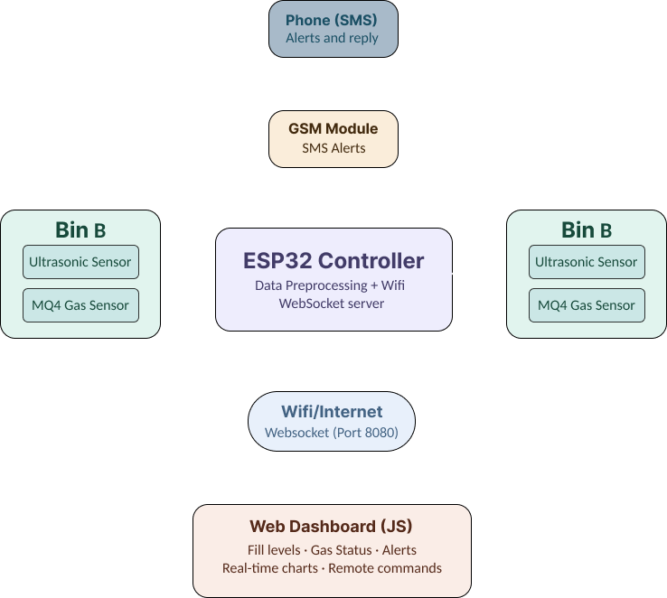

# Smart Waste Management System

Real-time bin monitoring, gas detection, live dashboard analytics, and intelligent collection routing for a hackathon-ready smart city waste workflow.

## Overview

This project combines ESP32-based sensing, a Node.js WebSocket server, and a React dashboard to monitor waste bins in real time. It tracks fill levels and gas values, raises alerts for risky conditions, and visualizes collection planning on an interactive map centered on Pune.

The latest dashboard version includes:

- live bin monitoring for two real sensor bins
- simulated bins for demo and route-planning scenarios
- color-based bin status indicators
- map-based route planning with road-following directions
- intelligent bin selection before routing
- movable collection hub selection on the map

## System Block Diagram



## Problem Statement

Traditional waste collection often follows fixed schedules rather than actual bin conditions. That leads to:

- unnecessary trips to half-filled bins
- overflowed bins before pickup
- poor hygiene and odor issues
- higher fuel and manpower costs

This system solves that by making collection decisions data-driven and visible in real time.

## Solution

The Smart Waste Management System provides:

- real-time fill-level monitoring using ultrasonic sensors
- hazardous gas monitoring using MQ4 sensors
- WebSocket-based live updates from hardware to dashboard
- dashboard alerts for warning and critical conditions
- intelligent route planning for waste collection workers

## Architecture

### Hardware Layer

- ESP32 controller
- ultrasonic sensors for bin fill level
- MQ4 gas sensors for gas detection
- optional GSM module for SMS alerts

### Communication Layer

- Wi-Fi-enabled ESP32 communication
- Node.js WebSocket server on port `8080`
- real-time event streaming to the frontend

### Dashboard Layer

- React + Vite frontend
- Recharts for analytics
- React Leaflet + OpenStreetMap for mapping

## Current Features

### Real-Time Dashboard

- live connection status
- per-bin fill percentage and gas value cards
- trend chart and comparison chart
- toast alerts when bins cross warning and critical thresholds

### Interactive Map

- Pune-centered map using OpenStreetMap
- live bins plus editable simulated bins
- marker colors based on fill level:
  - green: below 50%
  - yellow: 50% to 80%
  - red: above 80%
- numbered route-stop markers for selected bins
- changeable collection hub directly from the map

### Intelligent Route Planning

The routing pipeline now works in stages:

1. Bins below `50%` are ignored for collection.
2. Bins are filtered using a truck capacity constraint.
3. The truck selects bins without exceeding total capacity.
4. The route order is generated from the collection hub.
5. Each next stop is chosen using both urgency and distance.
6. The final route is drawn using road-following directions.

### Capacity-Aware Selection

- fixed truck capacity: `300` units
- bins are sorted by higher fill level first
- bins are added while total load stays within capacity
- oversized bins are skipped temporarily so smaller bins can still fit
- selected bins are then passed to route generation

## Tech Stack

### Hardware

- ESP32
- Ultrasonic sensor
- MQ4 gas sensor
- GSM module (optional)

### Software

- React
- Vite
- Recharts
- React Leaflet
- Leaflet
- Node.js
- WebSocket
- Tailwind CSS

## Project Structure

```text
.
|-- frontend/          # React dashboard
|-- waste-server/      # Node.js WebSocket server
|-- server_client/     # Additional server/client work
`-- docs/              # README assets and diagrams
```

## How To Run

### 1. Start the WebSocket Server

```powershell
node waste-server/server.js
```

By default the server runs on:

- `HOST=0.0.0.0`
- `PORT=8080`

### 2. Start the Frontend

```powershell
cd frontend
npm install
npm run dev
```

The app will open in Vite dev mode, usually on `http://localhost:5173`.

## Optional Hosted Setup

If the frontend needs to connect to a hosted WebSocket server, create `frontend/.env` and set:

```env
VITE_WS_URL=wss://your-domain.example/ws
```

## Demo Flow

For demo or presentation mode:

- use the live bins for real sensor data
- manually edit simulated bin fill values on the map panel
- change the collection hub location if needed
- show how the system re-selects bins based on truck capacity
- show how the final route updates using road directions

## Impact

This project helps:

- reduce unnecessary collection trips
- prevent overflow situations
- improve cleanliness and safety
- optimize truck utilization
- support faster municipal decision-making

## Future Enhancements

- predictive fill forecasting
- multi-truck allocation
- admin authentication and reporting
- cloud deployment and storage
- mobile app for field workers
- stronger SMS and remote command workflows

## Team

Team Innovators

- Hardware and sensor integration
- Backend and WebSocket communication
- Frontend dashboard and route visualization

## Note

This project was built as a fast-moving hackathon system and has been iteratively improved with live dashboard upgrades, better route logic, and presentation-ready visualizations.
